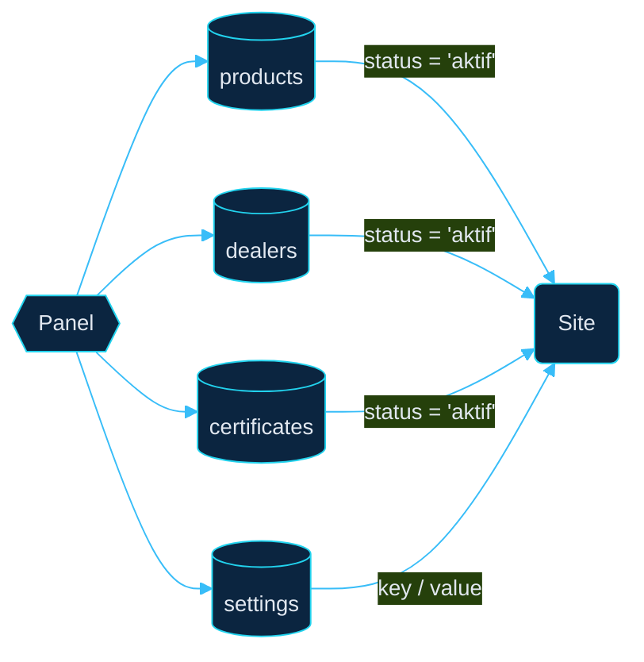

<p align="center">
  <b>Bir su markası için kurumsal site ve yönetim paneli.</b><br/>
  <sub>Ziyaretçi talep bırakır, panel takip eder, içerik tek yerden yönetilir.</sub>
</p>

<table align="center">
  <tr>
    <td align="center" width="140"><h2>7</h2><sub>PUBLIC SAYFA</sub></td>
    <td align="center" width="140"><h2>6</h2><sub>PANEL MODÜLÜ</sub></td>
    <td align="center" width="140"><h2>8</h2><sub>VERİ TABLOSU</sub></td>
    <td align="center" width="140"><h2>0</h2><sub>BACKEND FRAMEWORK</sub></td>
  </tr>
</table>

<br/>

---

<sub>01 — OVERVIEW</sub>

## İki yüz, tek veri kaynağı

Site ve panel aynı veritabanını paylaşır. Panelde yapılan her değişiklik — yeni bir ürün, güncellenen pH değeri, eklenen bir bayi — ön yüze anında yansır. Ön yüz yalnızca `status = 'aktif'` olan kayıtları gösterir.



<details>
<summary><b>Proje yapısı</b></summary>
<br/>

```text
.
├── index.php  kurumsal.php  urunler.php  kalite.php
├── bayiler.php  iletisim.php  basvuru.php
│
├── admin/
│   ├── login · login-process · logout
│   ├── dashboard · settings
│   ├── products · dealers · certificates    add / edit / delete
│   ├── leads · lead-detail · delete-lead
│   └── assets/
│
├── config/
│   ├── db.php           PDO bağlantı sınıfı (utf8mb4)
│   └── helpers.php      WebP dönüştürücü, slug üretici
│
├── includes/            header · footer · sidebar
├── assets/              style.css · main.js
└── uploads/             panelden yüklenen medya
```

</details>

<br/>

<sub>02 — FEATURES</sub>

## Ziyaretçinin gördüğü

<table>
  <tr>
    <td width="50%" valign="top">
      <b>İnteraktif şişe</b><br/>
      <sub>Şişeye tıklandığında ürün kartları dağılır ve süzülmeye başlar. Mobilde scroll ile tetiklenir. Web Animations API ile yazıldı.</sub>
    </td>
    <td width="50%" valign="top">
      <b>Akışkan sayfa geçişleri</b><br/>
      <sub>Hero slider, SVG dalga ayırıcılar ve ScrollReveal ile kademeli giriş animasyonları.</sub>
    </td>
  </tr>
  <tr>
    <td valign="top">
      <b>Panelden beslenen içerik</b><br/>
      <sub>Tecrübe yılı, pH değeri ve bayi sayısı koda gömülü değil, ayarlardan gelir.</sub>
    </td>
    <td valign="top">
      <b>Bayi ağı ve kalite belgeleri</b><br/>
      <sub>Bayiler il ve ilçeye göre sıralanır. Sertifikalar PDF ya da görsel olarak yayınlanır.</sub>
    </td>
  </tr>
</table>

## Ekibin kullandığı

<table>
  <tr>
    <td width="50%" valign="top">
      <b>Tek akışta tüm talepler</b><br/>
      <sub>İletişim talepleri ve bayilik başvuruları <code>UNION ALL</code> ile birleşir. Dashboard toplam, bekleyen, işlemde ve tamamlanan sayılarını gösterir.</sub>
    </td>
    <td width="50%" valign="top">
      <b>Talep durum hattı</b><br/>
      <sub>Her talep <code>yeni → işlemde → tamamlandı</code> ya da <code>iptal</code> olarak işaretlenir. Liste ad, telefon, e-posta, tür ve duruma göre filtrelenir.</sub>
    </td>
  </tr>
  <tr>
    <td valign="top">
      <b>İçerik yönetimi</b><br/>
      <sub>Ürün, bayi ve sertifika için ekleme, düzenleme ve silme. Ürün ve sertifika silinince sunucudaki dosyası da kaldırılır.</sub>
    </td>
    <td valign="top">
      <b>Site ayarları</b><br/>
      <sub>Başlık, iletişim bilgileri, harita, sosyal medya, logo ve favicon tek ekrandan.</sub>
    </td>
  </tr>
</table>

<br/>

<sub>03 — STACK</sub>

## Kullanılanlar

<p>
  
</p>

<sub>PHP · PDO · MySQL · Bootstrap 5.3 · jQuery · Slick · ScrollReveal · SweetAlert2 · Font Awesome 6 · GD</sub>

<br/>

<sub>04 — SETUP</sub>

## Çalıştır

| | Adım |
|:--:|:--|
| `1` | Repoyu klonla:<br/>`git clone https://github.com/aydin1925/water-brand-corporate-cms.git` |
| `2` | `karacapinar_db` adında `utf8mb4` bir veritabanı oluştur |
| `3` | Bağlantı bilgilerini `config/db.php` içinde güncelle |
| `4` | `uploads/` klasörüne yazma izni ver |
| `5` | Projeyi web sunucusunun köküne koy ve `/admin/login.php` adresinden panele gir |

> [!IMPORTANT]
> PHP'de `pdo_mysql` ve WebP destekli `gd` eklentileri açık olmalı. Görsel yüklemeleri WebP dönüşümüne bağlı.

> [!TIP]
> Şifreler hash'li saklanır. İlk admin için önce hash üret, sonra `admins` tablosuna ekle:
> ```bash
> php -r "echo password_hash('sifren', PASSWORD_DEFAULT);"
> ```

<br/>

---

<p align="center">
  <sub>Built by <a href="https://github.com/aydin1925"><b>@aydin1925</b></a></sub>
</p>
